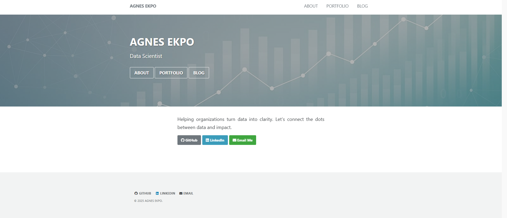

# Personal Website of Agnes Ekpo

Welcome to the repository for my personal website, showcasing my journey, projects, and insights in data science and beyond.



## Table of Contents

- [About the Website](#about-the-website)
- [Features](#features)
- [Installation](#installation)
- [Usage](#usage)
- [Customization](#customization)
- [Contributing](#contributing)
- [License](#license)
- [Acknowledgments](#acknowledgments)

## About the Website

This website serves as a digital portfolio and blog, reflecting my transition into the tech industry, particularly data science. It documents my experiences, projects, and thoughts on various topics.

## Features

- **Personal Blog:** Regular posts about my learning journey, projects, and musings.
- **Portfolio Showcase:** Highlights of my data science projects and collaborations.
- **Responsive Design:** Optimized for viewing on various devices.
- **Integrated Comments:** Engage with readers through the Giscus commenting system.

## Installation

To run this website locally:

1. **Clone the Repository:**

   ```bash
   git clone https://github.com/TheAEkpo/agnesekpo.com.git
